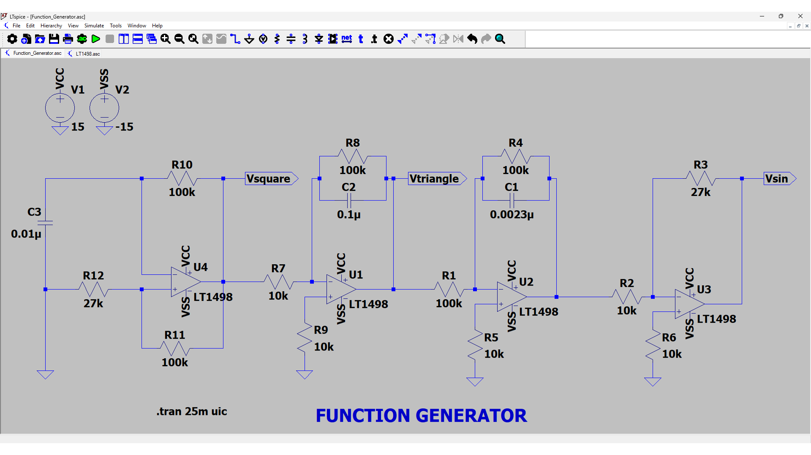
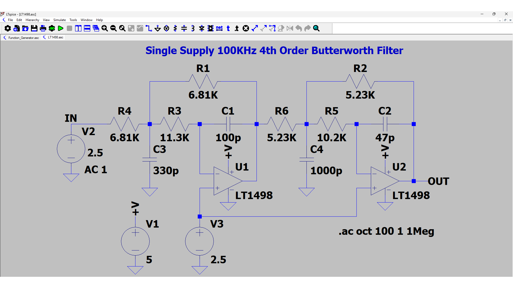
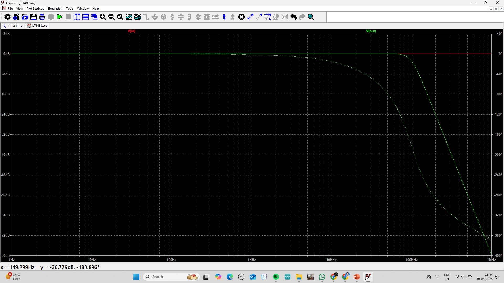
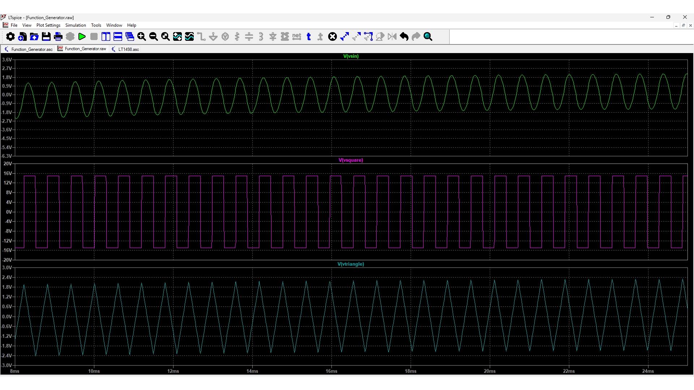

# FUNCTION GENERATOR USING LT1498 OP-AMP

## Overview

This project implements a **precision analog function generator** using multiple **LT1498 op-amps** configured in a multistage architecture to produce **triangle, square, and sine waveforms**. It emphasizes waveform purity, low distortion, and smooth transitions, making it suitable for analog testing, waveform synthesis, and lab instrumentation.

## Table of Contents

- [Project Objective](#project-objective)  
- [System Block Diagram](#system-block-diagram)  
- [Detailed Circuit Description](#detailed-circuit-description)  
  - [Stage 1: Square Wave Generator](#stage-1-square-wave-generator)  
  - [Stage 2: Triangle Wave Generator](#stage-2-triangle-wave-generator)  
  - [Stage 3: Sine Wave Shaper](#stage-3-sine-wave-shaper)  
- [Mathematical Analysis and Waveform Theory](#mathematical-analysis-and-waveform-theory)  
- [SPICE Netlist and Simulation](#spice-netlist-and-simulation)  
- [Performance Highlights](#performance-highlights)  
- [Applications and Use Cases](#applications-and-use-cases)  
- [Conclusion](#conclusion)  
- [References](#references)

## Project Objective

- Design a **waveform generation system** using op-amp-based integrators and shaping circuits.  
- Generate **low-distortion sine, triangle, and square waves** using discrete analog components.  
- Implement waveform interconversion via mathematical integration and shaping.  
- Simulate real-world conditions using SPICE for waveform validation and timing accuracy.

## System Block Diagram

<strong>Figure 1: Op-Amp Based Function Generator</strong>

<strong>Figure 2 : Single Supply 100KHz 4th Order Butterworth Filter</strong>

<strong>Figure 3 : Gain Plot of Single Supply 100KHz 4th Order Butterworth Filter</strong>

## Detailed Circuit Description

### Stage 1: Square Wave Generator

- **Op-Amp U4 (LT1498):** Configured as a **comparator with hysteresis**.
- **Feedback Resistors:** R10 and R11 define the hysteresis width to stabilize toggling.
- **Timing Capacitor:** C3 (0.01µF) with resistors forms the time constant to control oscillation frequency.
- **Output (Vsquare):** High-quality rail-to-rail square wave toggling between op-amp supply limits.

### Stage 2: Triangle Wave Generator

- **Op-Amp U1 (LT1498):** Acts as an **integrator**.
- **Integration Path:** Resistor R8 and capacitor C2 form the integrator loop.
- **Waveform Behavior:** Integrates the square wave input to yield a linear ramp up/down – a triangle wave.
- **Output (Vtriangle):** Symmetric triangle waveform with adjustable amplitude via resistor selection.

### Stage 3: Sine Wave Shaper

- **Op-Amp U3 (LT1498):** Converts triangle to sine via **non-linear shaping**.
- **Resistor-Diode Network:** R2, R3, and R4 shape the triangle into a sine-like curve.
- **Low-Pass Filtering:** C1 (0.0023µF) smoothens high-frequency distortion.
- **Output (Vsin):** Clean, approximated sine waveform suitable for lab usage.

## Mathematical Analysis and Waveform Theory

- **Square-to-Triangle Integration:**  
  Triangle slope \( = \frac{V_{peak}}{RC} \). R and C are tuned to get desired frequency and amplitude.

- **Triangle-to-Sine Shaping:**  
  Uses piecewise-linear approximation of sine using non-linear elements and passive shaping.

- **Oscillation Frequency:**  
  Set by RC time constant in U4’s feedback path:
  $$
  f = \frac{1}{2 \cdot R \cdot C}
  $$

## SPICE Netlist and Simulation

The entire circuit is modeled in SPICE using `.tran` simulation for transient analysis.

- **Simulation Duration:** 25ms with `.tran 25m uic`
- **Libraries Used:** `.lib LTC.lib` for LT1498 models
- **Key Nodes:**  
  - `Vsquare`: Square wave  
  - `Vtriangle`: Integrated triangle wave  
  - `Vsin`: Shaped sine wave

Simulation confirms waveform purity, timing accuracy, and conversion consistency.

<strong>Figure 1: Output Waveform of Op-Amp Based Function Generator</strong>

## Performance Highlights

- **Three Waveforms:** Triangle, Square, and Sine from a single oscillator.
- **LT1498 Quad Op-Amp:** Enables compact design and rail-to-rail output.
- **Stable Oscillations:** Resistor and capacitor values selected for ~1kHz frequency range.
- **Low Distortion:** Smooth shaping network minimizes harmonic content in sine wave.

## Applications and Use Cases

- Analog signal simulation and testing.
- Educational labs and electronics prototyping.
- Function generator module in embedded systems.
- Low-cost waveform generator alternative for audio and instrumentation.

## Conclusion

This project demonstrates a powerful analog technique to generate **precision waveforms** using only op-amps and passive components. Its modular and expandable design is ideal for students, educators, and analog designers seeking waveform synthesis without digital control or microcontrollers.

## References

- Linear Technology, [LT1498 Datasheet](14989fg.pdf)  
- *Art of Electronics*, Horowitz & Hill  
- Texas Instruments, [Waveform Generator Application Notes](TI_App_Note.pdf)  

**Shape signals. Shape innovation. 🌀⚡📡**
